# git授课文档

## 课程目的

- 在JavaScript基础课程完结之后，大家已经可以完成简单的小项目了，在实际工作开发中，并不是一个人敲代码，需要团队的协作，用版本控制工具会提高我们程序员的项目开发效率。所以目的之一就是让大家在初次搭建项目的时候就能熟悉以后工作时候的环境，培养一个好的团队合作习惯。

- 在Web API第三天开始会有一个班级小组之间的项目评比，具体布置我会在明天晚上和大家说明，对项目的要求是用你们现阶段所学加上团队小组合作，完成你们的第一个自主项目。对于项目的其中一点要求就是项目完成后需要推送到自己的git上。

- 在很多面试的要求中在git上有自己的作品，有自己的项目。作为一个合格的程序员，作为一个有多年工作经验的程序员，在git上都会有自己上传的作品，熟悉git的使用并且往上推送作品，会是你们之后找工作的一个加分项。

  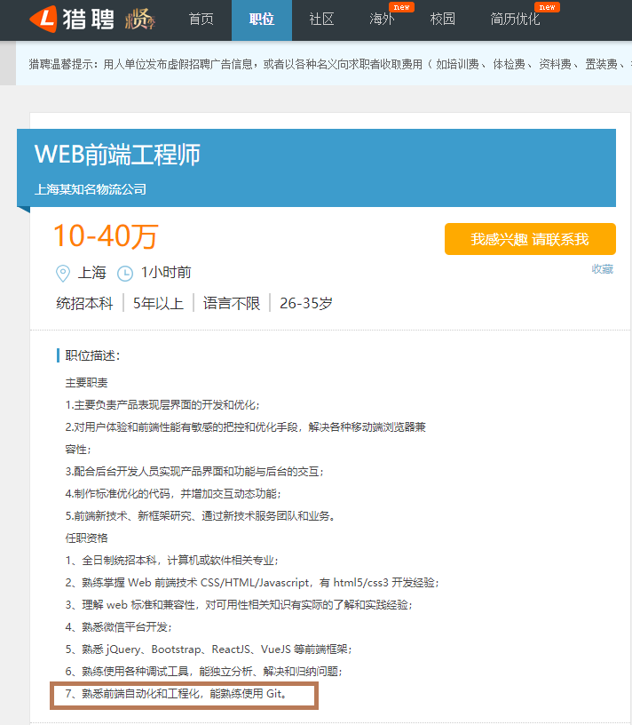

## 课程要求

- 了解git是什么？
- 使用git的作用是什么？
- 会使用常用的git命令。
- 能将自己写的项目推到远程仓库中。
- 在Web API第三天开始会有一个班级小组之间的项目评比，具体布置我会在明天晚上和大家说明，对项目的要求是用你们现阶段所学加上团队小组合作，完成你们的第一个自主项目。对于项目的其中一点要求就是项目完成后需要推送到自己的git上。

## git的安装

安装包在教学资料文件夹下的软件文件夹中。

**注意**：`1. 不要安装在中文目录` ：以后安装软件都要注意这一点，很多软件安装路径存在中文会出错。

​	   `2. 不要使用桌面管理软件`：使用桌面管理软件以后，右键出现的菜单会被管理，会隐藏我们要使用的功能按钮。

安装很简单，一直下一步即可。在任意的目录下右键，能够出现 `Git GUI Here `  和 `Git Bash Here` ，表示安装成功了。

## 例子

- 当我们做甲项目时，做到了一半。
- 此时Boss说你手头的项目先停一停，先做乙项目，马上要上线了，此时你停下手头的事开始做乙项目。
- 当乙项目做到一半的时候，Boss又说你做甲项目去吧，乙项目延后了，这时候你又去做甲项目了。
- 但是甲项目已经被你同事做了一大半了，此时你很高兴，然后接着往后做。（你们此时怎么配合）
- 当甲项目做了一大半的时候，万恶项目经理说你们做的不好，要你从你之前写到一半的地方重新写。（你怎么办）
- 当你甲项目改了到一大半的时候，此时万恶的产品经理又说客户的需求改了，之前写的就很好，要你复原之前的项目（。。。）
- 。。。。。。。。
- 告辞！（我要删库！！）（项目经理怎么办）

在实例开发过程中，与团队的配合协作往往会花很多的时间与经历，并且每一次手动保存很耗时间和精力，为了将我们的精力都用在开发上，现在公司开发项目都会用到版本控制工具。

## 为什么要有版本控制系统？

1. 在开发过程中，经常需要对一个文件进行修改甚至删除，但是我们又希望能够保存这个文件的历史记录，如果通过备份，那么管理起来会非常的复杂和繁琐。
2. 在多人开发时，如果需要多人合作开发一个页面，那么修改以及合并也会非常的棘手。容易出现冲突。

##什么是版本控制系统？

**版本控制系统**（Version Control System）:是一种记录一个或若干文件内容变化，以便将来查阅特定版本修订情况的系统。版本控制系统不仅可以应用于软件源代码的文本文件，而且可以对任何类型的文件进行版本控制。

常见的版本控制系统有：cvs、svn、**git** （了解即可）

## 版本控制系统的分类

#### 本地版本控制系统

本地版本控制系统就是在一台机器上，记录版本的不同变化，保证内容不会丢失。

缺点：如果多人开发，每个人都在不同的系统和电脑上开发，没办法协同工作。

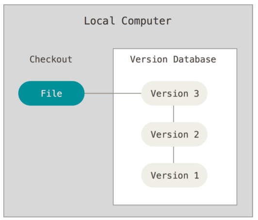

#### 集中式版本控制系统

svn/cvs都是集中式的版本控制系统。

1. 需要一个中央服务器来管理代码的的版本和备份。
2. 所有的用户电脑都是从中央服务器获取代码或者是将本地的代码提交到中央服务器。
3. 依赖与网络环境，如果连不上中央服务器，就无法提交和获取代码。
4. 如果中央服务器宕机，所有人都无法工作。

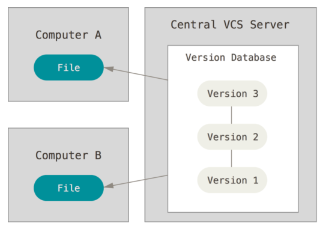

#### 分布式版本控制系统

git是分布式的版本控制系统。

1. 需要一台服务器作为代码仓库。
2. 每个用户电脑都是一个服务器（代码仓库），并且和代码仓库是镜像的，用户修改和获取代码都是提交到自己的服务器当中。
3. 不需要网络就可以进行工作。
4. 当连接网络时，用户可以选择将自己的服务器与代码仓库进行同步。

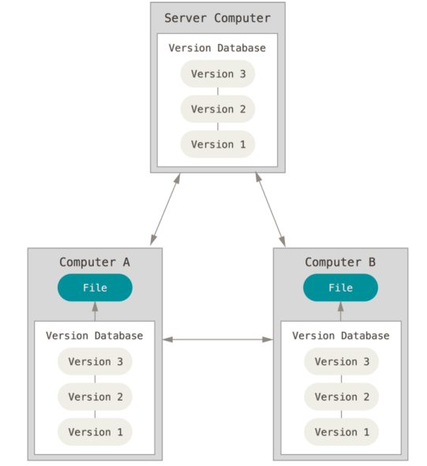

## git介绍

> Git是一款**免费**、**开源**的**分布式** **版本控制系统** ，用于敏捷高效地处理任何或小或大的项目。

Git 是 Linus Torvalds 为了帮助管理 Linux 内核开发而开发的一个开放源码的版本控制软件。

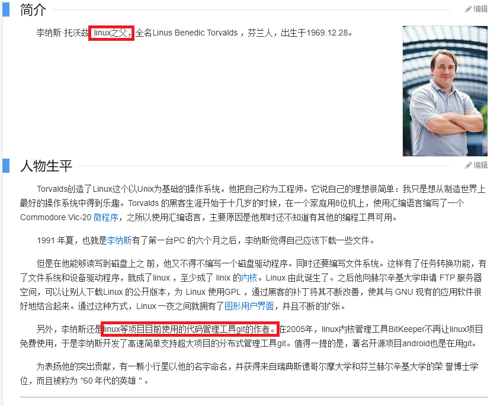

## 现阶段学习git的使用目的和必要性

- 可以将咱们之后上课敲的代码、敲的项目推到git上面，方面咱们的学习和管理。
- 是一个拥有实际开发经验的程序员必备的技能。
- 在以后的面试过程中是一个加分项。
- 等等。。。。。。

## git的使用方式

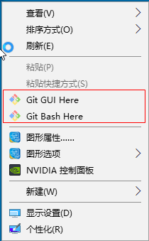

git是用法方式主要有两种。

- git gui，即图形化界面的方式。
- git bash，（cmi）命令行的方式。

**给window用户的忠告：git的命令必须使用linux风格的shell来运行Git命令，不能使用window风格的shell运行git命令** 

1. 在任意文件夹中，都可以使用右键，通过git bash here打开命令行窗口，此时的路径就是当前目录。
2. 窗口上右键，通过options-->Text-->select可以调整字体的大小。

## bash入门（了解）

bash是许多linux系统默认的shell(命令行工具)。

cmd和powershell是window系统默认的shell(命令行工具)。

二者的功能都一样，通过命令行来操作计算机的功能。

**为什么要学习bash？**

- 必须使用linux风格的shell来运行git命令
- 工作过程中，项目都是部署在linux系统中，了解一些常用的bash命令也是有必要的。

```bash
# cd 改变目录  （change directory）
cd images   #进入images文件夹
cd ..      #进入上一层目录
cd ~       #进入用户根目录

# tab  自动补全，当我们输命令或者目录很长时，可以使用tab键进行自动补全。
# 按两次tab，会把所有符合要求的内容都列出来。

# pwd 打印当前目录的路径 （print work directory）

pwd

# ls 展示当前目录列表（list）
ls         # 展示当前目录
ls -a      # 展示全部内容，包括隐藏文件
ls -l      # 以列表的形式展示内容

# clear reset清屏
clear  # 清除屏幕内容，滚动条，保留了历史
reset  # 重置，历史记录没了。


# mkdir  创建一个文件夹 （make directory）
mkdir css          # 创建一个css的文件夹
mkdir css img js   # 创建了三个文件夹

# rmdir  删除一个空的文件夹（没啥用）
rmdir img   # 删除文件夹

# touch  创建文件
touch index.html   #创建了一个index.html文件
touch css/index.css # 在css目录下创建idnex.css文件

# rm 删除一个文件获取文件夹
rm index.html # 删除index.html文件
rm js         # 删除空的js文件夹
rm -r css     # 递归删除一个文件夹

# mv 移动文件（move）
mv index.html js            # 将html文件移动到js文件夹中
mv index.html index2.html   # 将index.html重命名为index2.html

# cp 复制文件（cp）
cp index.html index2.html   # 复制index.html文件，命名为index2.html
cp -r css css02             # 如果复制的是文件夹，需要使用-r参数。

# cat 查看文件全部内容
cat index.html
```

练习：

1. 在桌面新建一个 `test`文件夹
2. 在test文件夹中打开git命令窗口
3. 创建 css  images js 三个文件夹
4. 新建index.html文件，在css文件中新建index.css文件，  在images中新建index.png文件，在js文件中新建index.js
5. 把index.html重命名为index2.html
6. 把index.css文件挪到js文件中

## git初体验

在第一次使用的时候，需要配置你的用户邮箱和用户名称，这两条配置是很重要的，每次提交git代码都会引用这两条信息，记录了谁提交了代码，会永久的记录在历史记录中。

```bash
# git config  user.name 你的目标用户名
# git config  user.email 你的目标邮箱名

# 使用--global参数，配置全局的用户名和邮箱，只需要配置一次即可。
git config  --global user.name rwt
git config  --global user.email 666666@qq.com

# 查看配置信息
git config --list
```

1. 初始化git仓库`git init`
2. 查看当前git仓库的状态`git status`
3. 将文件添加到git的暂存区`git add 文件名`
4. 将文件由暂存区提交到仓库区`git commit -m '提交说明'`
5. 查看提交日子`git log`

```bash
# 要对某个项目使用git进行管理，需要使用git init命令初始化git仓库
# 会在当前目录生成一个隐藏文件夹 .git  不要去修改这个文件夹下的任意东西。
git init

# 查看git文件的状态 ,如果此时新建一个文件，那么这个文件是没有被追踪的，说白了git还没有管理这个新建的文件
git status 

# 告诉git开始对index.html文件进行追踪， git会在暂存区中存储这个文件
git add index.html

# 让文件由暂存区提交到仓库区。此时文件才真正的被git管理了。
# 如果提交日志乱码，右键-->options-->Text-->将编码改成utf-8

git commit -m '第一次提交'

# 查看提交日志
git log
```

## git的三个区

工作区、暂存区、本地仓库区

工作区：我们书写代码的地方，工作的目录就叫工作区。

暂存区：使用add命令，在`.git`目录中的一个索引文件，记录修改的文件

本地仓库区：将保存在暂存区域的内容永久转储到 Git 仓库中，生成版本号。生成版本号之后，就可以任何的回退到某一个具体的版本。

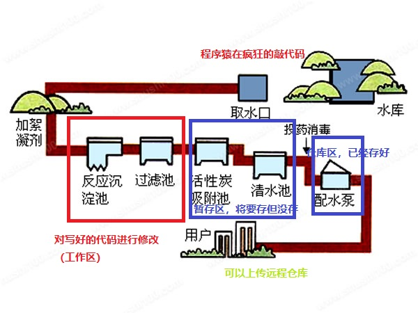

## git命令详解

#### git add(重点)

- 作用：让git追踪一个新的文件，并且将文件由 工作区 添加到 暂存区，暂存文件
- 命令：`git add 文件名/目录名`
  - 例如： `git add index.html`
- `git add --all` 或者 `git add -A` 获取`git add .`（简写） 添加所有文件
- `git add a.txt b.txt` 同时添加两个文件
- `git add *.js` 添加当前目录下的所有js文件
- `git add css/`添加css目录下所有的文件

#### git checkout 文件名

- 作用：暂存区的内容恢复到工作区。
- `git checkout 1.txt` 将暂存区中1.txt文件恢复到工作区

#### git commit（重点）

- 作用：将文件由 暂存区 添加到  仓库区，生成版本号（历史记录，以后可以回退到某一个版本号）
- `git commit -m "提交说明"`

#### git status

- 作用：查看文件的状态


- 命令：`git status`
- 命令：`git stauts -s` 简化日志输出格式

#### git log

- 作用：查看提交日志
- `git log` 只能查看当前head以及以前的日志
- `git log --oneline` 简洁的日志信息,如果提交的日志非常多了
- `git reflog` 查看所有的提交变更日志

#### git reset

- 作用：版本回退，将代码恢复到已经提交的某一个版本中。
- `git reset --hard 版本号` 将代码回退到某个指定的版本(版本号只要有前几位即可)
- `git reset --hard head~1`将版本回退到上一次提交
  - ~1:上一次提交
  - ~2:上上次提交
  - ~0:当前提交

## 远程仓库

所有的程序员都可以通过远程仓库来进行版本的共享，达到所有人的代码一致的效果。

## github

git与github没有直接的关系。

- git是一个版本控制工具。
- github是一个代码托管平台，是git的一个远程代码仓库。
- 将来工作时，公司会有自己的代码仓库。

[github官网](https://github.com/)（每位同学都要注册）

[开源中国-git](https://git.oschina.net/)

```bash
1. gitHub是一个面向开源及私有软件项目的托管平台，因为只支持git 作为唯一的版本库格式进行托管，故名gitHub。
2. github免费，代码所有人都能看到，但是只有你自己能修改。付费的可以隐藏。
```

在github上创建一个项目，获取到仓库的地址。然后就可以将本地的代码推送到远程的服务器上。

注册步骤：

1. 打开[github官网](https://github.com/)（每位同学都要注册）：

   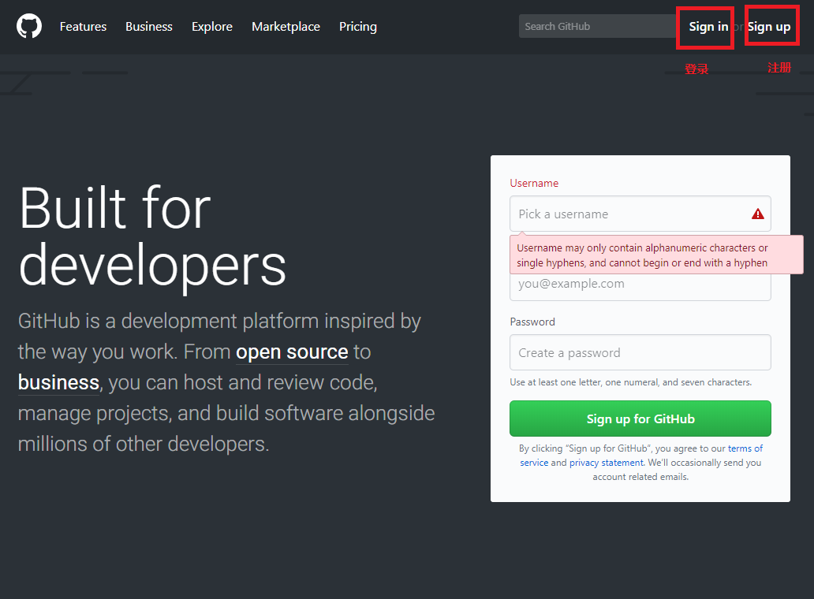

2. 填写信息，进行注册：

   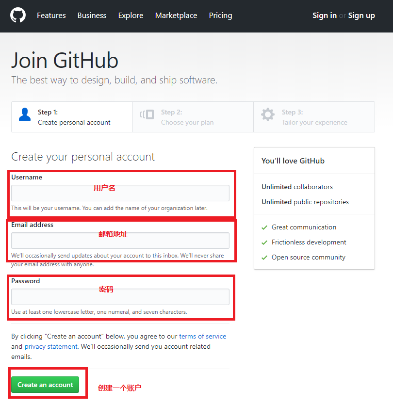

   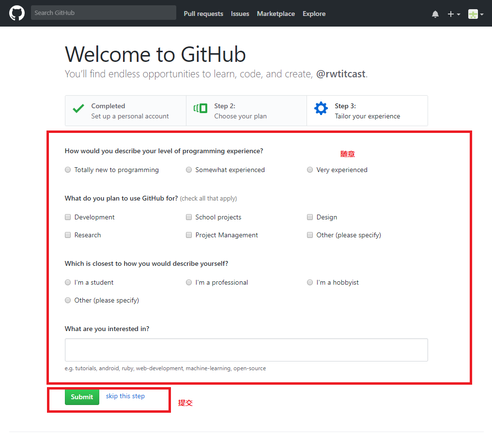

 3. 登录：

    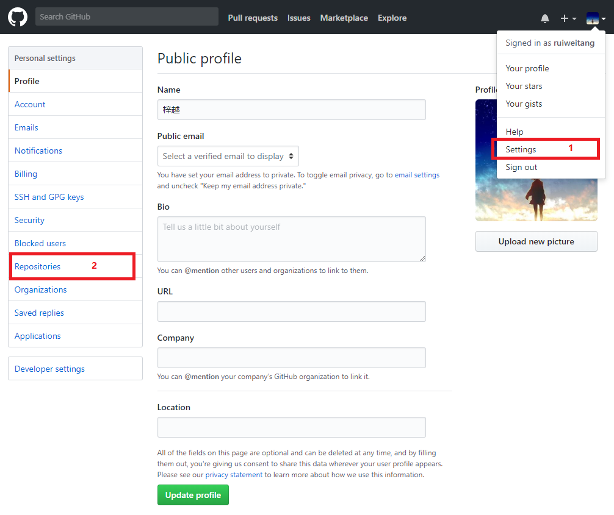

    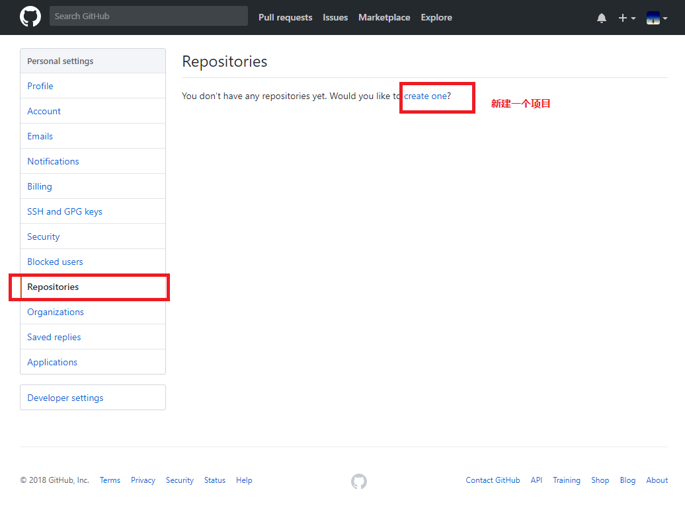

    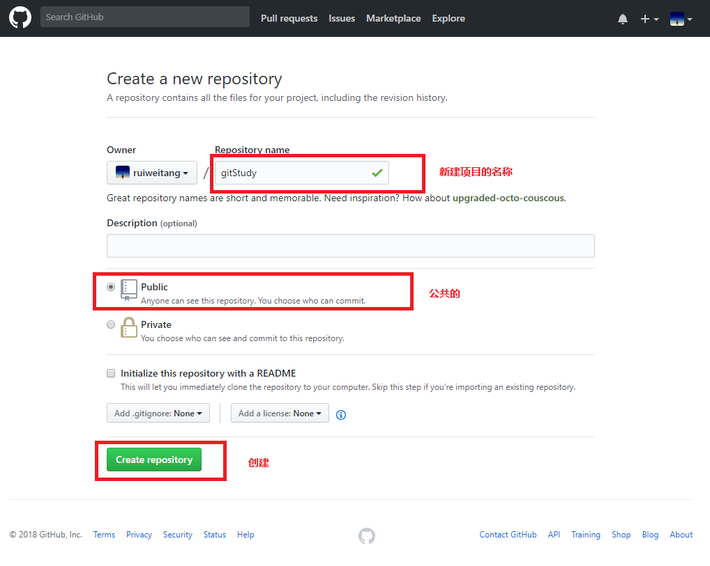

    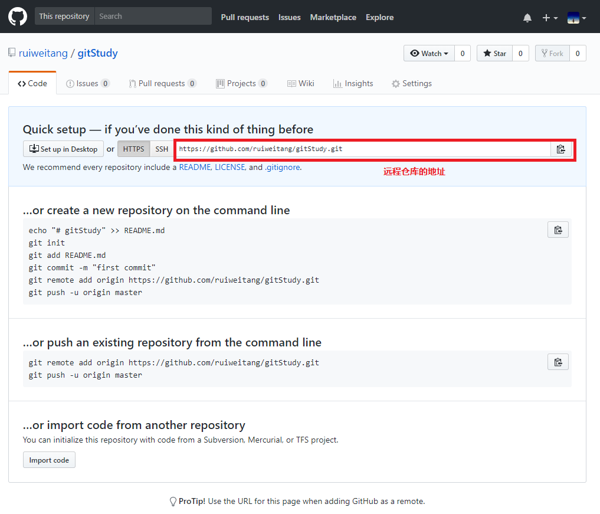

## 远程仓库相关命令

### git push

- 作用：将本地仓库中代码提交到远程仓库
- `git push 仓库地址 master` 在代码提交到远程仓库，注意master分支必须写，不能省略
- 例子：` git push https://github.com/ruiweitang/gitStudy.git master` 如果第一次使用，需要填写github的用户名和密码
- 在git push之前，先git pull: 保证先把远程仓库代码先拉取到本地

### git pull

- 作用：将远程的代码下载到本地
- `git pull 代码地址 master` 将远程的代码中master分支下载到本地
- 通常在push前，需要先pull一次。

### git clone

- 作用：克隆远程仓库的代码到本地
- git clone [远程仓库地址]
- `git clone https://github.com/ruiweitang/gitStudy.git`会在本地新建一个`gitStudy`文件夹，在gitStudy中包含了一个`.git`目录，用于保存所有的版本记录，同时gitStudy文件中还有最新的代码，你可以直接进行后续的开发和使用。
- git克隆默认会使用远程仓库的项目名字，也可以自己指定。需要是使用以下命令：`git clone [远程仓库地址] [本地项目名]`（gitStudy->自己想要的名字）

### git remote

每次push和pull操作都需要带上远程仓库的地址，非常的麻烦，我们可以给仓库地址设置一个别名

- `git remote add 仓库别名 仓库地址` 使用仓库别名替代仓库地址。仓库别名相当于一个js变量，仓库地址就是对应的值。
  - `git remote add rwt https://github.com/ruiweitang/gitStudy.git` 设置了一个rwt的仓库别名，以后push和pull都可以不用仓库地址，而用rwt，origin
- `git remote remove rwt` 删除rwt这个仓库别名。
- `git remote` 查看所有的仓库别名
- 如果使用了`git clone`命令从远程仓库获取下来的，那么这个本地仓库会自动添加一个 origin的远程地址，指向的就是克隆的远程地址。

## SSH免密码登录

git支持多种数据传输协议：

- https协议：`https://github.com/ruiweitang/gitStudy.git`  需要输入用户名和密码
- ssh协议：`git@github.com:ruiweitang/gitStudy.git`   可以配置免密码登录

每次push或者pull代码，如果使用https协议，那么都需要输入用户名和密码进行身份的确认，非常麻烦。

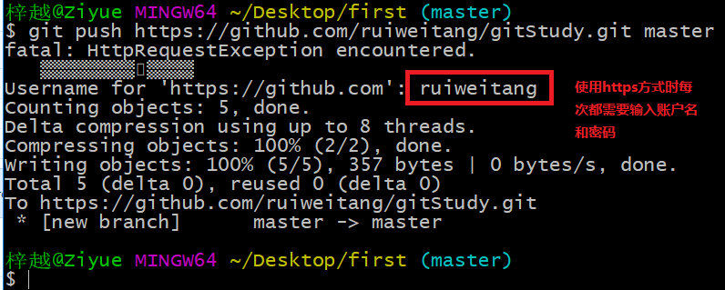

- github为了账户的安全，需要对每一次push请求都要验证用户的身份，只有合法的用户才可以push
- 使用ssh协议，配置ssh免密码，可以做到免密码往github推送代码

## SSH免密码登录配置

注意：这些命令需要在bash中敲

1. 创建SSH Key：`ssh-keygen -t rsa`
2. 在文件路径 `C:\用户\当前用户名\` 找到 `.ssh` 文件夹
3. 文件夹中有两个文件：
   - 私钥：`id_rsa`
   - 公钥：`id_rsa.pub`
4. 在 `github -> settings -> SSH and GPG keys`页面中，新创建SSH key
5. 粘贴 公钥 `id_rsa.pub` 内容到对应文本框中
6. 在github中新建仓库或者使用现在仓库，拿到`git@github.com:用户名/仓库名.git`
7. 此后，再次SSH方式与github“通信”，不用输入密码确认身份了


## 关于拓展

你们现阶段会使用常用的命令，能上传自己的项目即可，到了后期做全端项目的时候，老师还会给你们讲git更多的用法，对于现阶段的你们来说，只要掌握今天讲的就可以了，只有基础牢固，才能有更好的飞跃，由量变才能到质变。